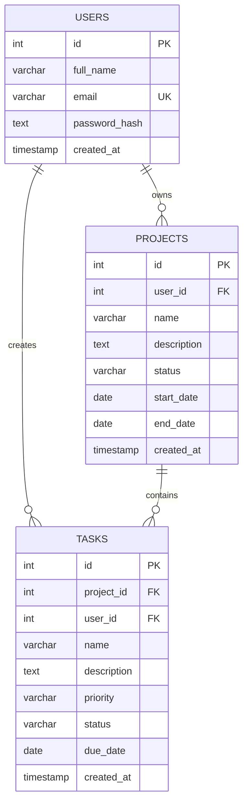

# ER Diagram

## Entity Relationship Diagram

The Project Management System contains three main entities:

- **USERS**
- **PROJECTS**
- **TASKS**



## Relationship Explanation

### 1. Users → Projects

```text
USERS 1 ──────────── N PROJECTS
```

One user can own multiple projects.

The relationship is implemented using:

```text
projects.user_id → users.id
```

### 2. Projects → Tasks

```text
PROJECTS 1 ───────── N TASKS
```

One project can contain multiple tasks.

The relationship is implemented using:

```text
tasks.project_id → projects.id
```

### 3. Users → Tasks

```text
USERS 1 ──────────── N TASKS
```

A user can own/create multiple tasks.

The relationship is implemented using:

```text
tasks.user_id → users.id
```

## Simplified Relationship View

```text
                 ┌───────────────┐
                 │     USERS     │
                 │───────────────│
                 │ PK id         │
                 │ full_name     │
                 │ UK email      │
                 │ password_hash │
                 └───────┬───────┘
                         │
                    1    │    N
                         │
                         ▼
                 ┌───────────────┐
                 │   PROJECTS    │
                 │───────────────│
                 │ PK id         │
                 │ FK user_id    │
                 │ name          │
                 │ description   │
                 │ status        │
                 │ start_date    │
                 │ end_date      │
                 └───────┬───────┘
                         │
                    1    │    N
                         │
                         ▼
                 ┌───────────────┐
                 │     TASKS     │
                 │───────────────│
                 │ PK id         │
                 │ FK project_id │
                 │ FK user_id    │
                 │ name          │
                 │ description   │
                 │ priority      │
                 │ status        │
                 │ due_date      │
                 └───────────────┘
```

## Keys

### Primary Keys

```text
users.id
projects.id
tasks.id
```

### Foreign Keys

```text
projects.user_id → users.id

tasks.project_id → projects.id

tasks.user_id → users.id
```

### Unique Key

```text
users.email
```

The email is unique so that two accounts cannot be registered with the same email address.

## Cardinality Summary

| Relationship | Cardinality |
|---|---|
| User → Projects | 1 : N |
| User → Tasks | 1 : N |
| Project → Tasks | 1 : N |

## Database Flow

```text
                    PostgreSQL
                         │
             ┌───────────┴───────────┐
             │                       │
           USERS                  PROJECTS
             │                       │
             │                       │
             └────────────┐          │
                          │          │
                          ▼          ▼
                             TASKS
```

The same PostgreSQL database is shared by the React web application and Flutter Android application through the Node.js/Express REST API.
